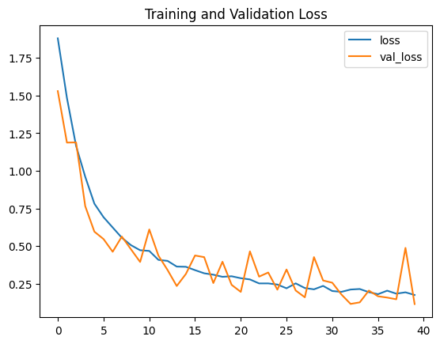
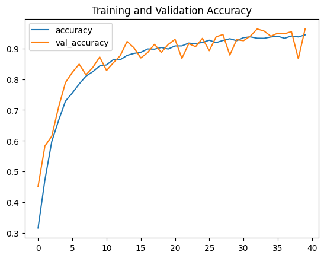
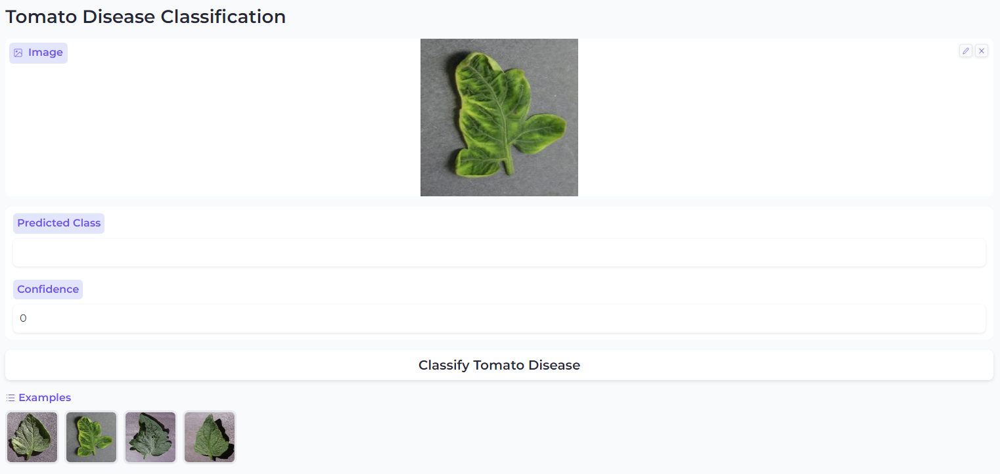

# Tomato Disease Classification: Project Overview

This project aims to classify diseases in tomato plants using a Convolutional Neural Network (CNN). 
A FastAPI web server is built to take in requests for images and return predicted diseases with confidence levels.

## Problem Statement
Tomato diseases can cause significant damage to tomato crops, resulting in decreased yield and economic losses. Early detection and prevention of diseases are crucial for maintaining healthy tomato plants and maximizing crop productivity. This project utilizes CNN-based image classification to identify diseases in tomato plants, offering a potential solution for timely disease detection and management.

## Code and Resources Used 
**Python Version:** 3.9  
**Packages:** tensorflow, pandas, numpy, matplotlib  
**Install Python Packages:**  ```pip install -r requirements.txt```  
**Project Inspiration:** https://www.youtube.com/playlist?list=PLeo1K3hjS3ut49PskOfLnE6WUoOp_2lsD  
**FastAPI:** https://youtu.be/t6NI0u_lgNo?list=PLeo1K3hjS3ut2o1ay5Dqh-r1kq6ZU8W0M  
**Dataset:** https://www.kaggle.com/datasets/arjuntejaswi/plant-village


## Data Preprocessing
Before building the CNN model, the data is preprocessed using the following steps:

- Data is loaded into a TensorFlow Dataset.
- The dataset is split into training, validation, and test datasets with an 8:1:1 ratio.
- Performance of input pipelines is optimized through caching and prefetching.
- Images are resized and rescaled.
- Data augmentation techniques are applied, including random horizontal and vertical flips, random rotation, and random contrast adjustments.
	

## Model Building 
The image classification model is built using a CNN architecture implemented with TensorFlow's Keras API. The model architecture consists of multiple Conv2D and MaxPooling2D layers, followed by Flatten and Dropout layers (with a dropout rate of 0.4) for regularization, and finally Dense layers for classification.  

The hyperparameters used in the model training include:
- Optimizer: `Adam` optimizer with default parameters
- Loss function: `SparseCategoricalCrossentropy` 
- Metrics: `accuracy`
- Batch size: 32
- Number of epochs: 40
- Early stopping: `EarlyStopping` callback with a patience of 10

## Training and Validation Accuracy and Loss
The training and validation accuracy and loss are visualized in the following plots:



## Model performance on test dataset
The trained model achieves a loss of 0.1086 and an accuracy of 0.9631 on the test dataset, indicating good performance in disease classification.

## Productionization 
The trained CNN model is exported to a file on disk, and a FastAPI web server is built for serving predictions. The API takes in requests for images and returns predicted diseases with confidence levels, making it a useful tool for practical applications.

## Hugging Face Spaces

The trained tomato disease classifier is hosted on Hugging Face Spaces. You can access the model and interact with it using the following link:
[Tomato Disease Classifier on Hugging Face Spaces](https://huggingface.co/spaces/Gary0417/tomato-disease-classification)

